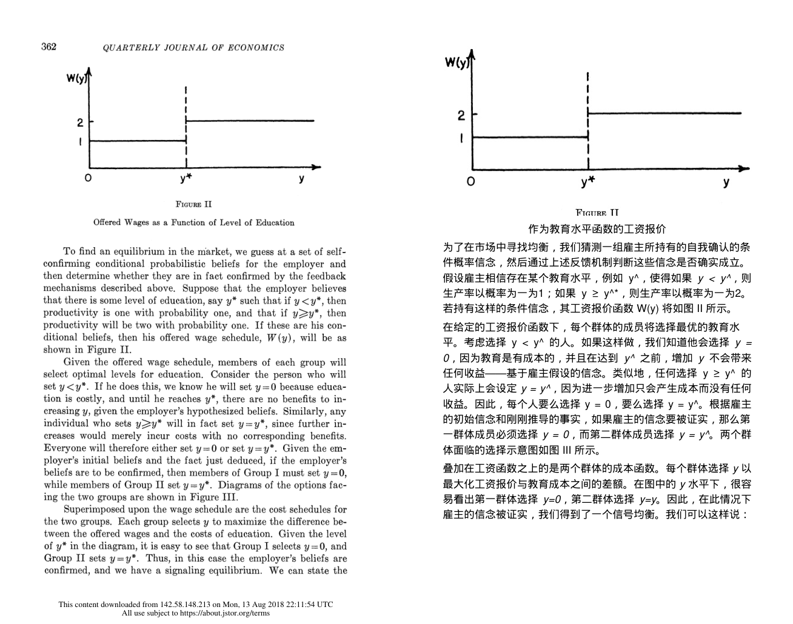

# PDF 双语对照翻译器

> 用 **PaddleOCR-VL** 解析 PDF（公式/表格/图片识别准），用 **DeepSeek** 翻译，生成**逐页英中对照**的 PDF。原文页与译文页交替排列，公式按 LaTeX 重新渲染，图片、表格原样保留。

适合翻译**学术论文、技术文档、带公式和图表的书籍**。



## ✨ 特性

- **逐页对照**：原英文页 + 渲染的中文页交替，严格 1:1 对应，方便对照阅读
- **公式精准**：飞桨解析 LaTeX，本地 matplotlib 渲染；公式尺寸自动与正文协调
- **图表保留**：原文插图、图表自动下载并嵌入译文页
- **批量并发**：多个 PDF 并发 OCR，逐页并发翻译
- **桌面版**：填入两个 key、选 PDF、点开始即可，无需命令行
- **隐私**：密钥只存在你本机（`~/.pdf-bilingual-translator/config.json`），不上传任何第三方

## 🔑 准备两个密钥

| 服务 | 用途 | 获取地址 |
|---|---|---|
| **DeepSeek API Key** | 翻译 | https://platform.deepseek.com/ → API Keys |
| **PaddleOCR Token** | PDF 解析 | 百度 AI Studio PaddleOCR-VL 应用控制台 |

## 🖥️ 桌面版（推荐）

### 方式一：下载 exe（Windows）
到 [Releases](../../releases) 下载 `PDF双语翻译器.exe`，双击运行。

### 方式二：从源码运行
```bash
pip install -r requirements.txt
python gui.py
```

界面里填入两个密钥 → 「添加文件 / 添加文件夹」选 PDF → 设置输出目录 → 「▶ 开始翻译」。密钥会保存在本机，下次自动带出。

## 🌐 网页版（多用户，服务端统一密钥）

FastAPI 后端 + 原生前端：用户注册账号 → 上传 PDF → 后台翻译 → 下载双语对照 PDF。密钥由服务端统一提供，每账号每天有页数额度（默认 300 页/天）。

```bash
pip install -r requirements-web.txt
cp webapp/server_config.example.json webapp/server_config.json   # 填入 key
bash webapp/run.sh                                                # http://localhost:8000
```

完整部署步骤见 [`webapp/DEPLOY.md`](webapp/DEPLOY.md)。

## ⌨️ 命令行

```bash
pip install -r requirements.txt

# 密钥：环境变量 或 复制 config.example.json 为 config.json 填入
export DEEPSEEK_API_KEY="sk-..."
export PADDLE_TOKEN="..."

python cli.py paper.pdf                 # 单个文件
python cli.py ./papers                  # 整个目录
python cli.py ./papers -o ./out         # 指定输出目录
```

输出（默认 `output/`）：
- `xxx-dual.pdf` —— 逐页英中对照（核心产物）
- `xxx-en.md` / `xxx-zh.md` —— OCR 英文 / 译文 Markdown，便于核对

## 📦 打包 exe

```bash
pip install pyinstaller
python build_exe.py        # 产物在 dist/
```

## 🧩 工作原理

```
PDF ──PaddleOCR-VL异步API──► 逐页 Markdown(含LaTeX/表格/图片)
                              │
                       DeepSeek 逐页翻译(保留公式/标记)
                              │
                    PyMuPDF 渲染中文页 + 公式(matplotlib) + 图片(内嵌)
                              │
                  ◄── 原英文页 + 中文页 交替的对照 PDF
```

- OCR 关闭了 `restructurePages`/`mergeTables`，保证与原 PDF 严格逐页对应
- 网络阶段（OCR/翻译）多线程并发，渲染阶段（PyMuPDF）串行（跨文档非线程安全）
- 公式含中文时走 HTML 文本渲染，避免数学字体缺中文字形

## 📂 项目结构

```
pdf_translator/
├── config.py          # 密钥与参数配置
├── ocr.py             # PaddleOCR-VL 异步 OCR + 图片下载
├── translate.py       # DeepSeek 翻译
├── formula_render.py  # LaTeX 公式 → 图片/HTML
├── render.py          # 双语对照 PDF 渲染
└── pipeline.py        # 批量流水线
cli.py                 # 命令行入口
gui.py                 # 桌面版 (CustomTkinter)
build_exe.py           # PyInstaller 打包
```

## ⚖️ License

MIT

## 🙏 致谢

[PaddleOCR-VL](https://github.com/PaddlePaddle/PaddleOCR) · [DeepSeek](https://www.deepseek.com/) · [PyMuPDF](https://pymupdf.readthedocs.io/) · [CustomTkinter](https://github.com/TomSchimansky/CustomTkinter)
